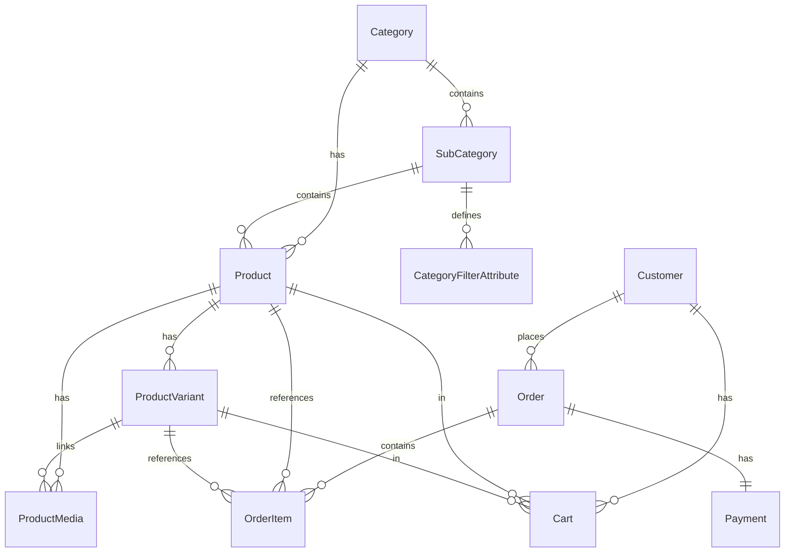

# 🛒 TrendyKart — Enterprise E-Commerce Platform (.NET 10 MVC & SQL Server)

[](https://dotnet.microsoft.com/)
[](https://www.microsoft.com/sql-server)
[](https://docs.microsoft.com/ef/core/)
[](https://razorpay.com/)

TrendyKart is an enterprise-grade e-commerce web application built using **ASP.NET Core 10 MVC** and **Microsoft SQL Server**. It features Flipkart/Amazon-style multi-variant product support, dynamic category-attribute filters, hierarchical GST & shipping engines, Razorpay payment gateway integration, automated itemized PDF tax invoicing, and a complete admin management portal.

---

## 👤 Author Details

- **Developer**: Mohd Zaid
- **Email**: [Zaidm1323@gmail.com](mailto:Zaidm1323@gmail.com)
- **LinkedIn**: [linkedin.com/in/mohd-zaid-794090231](https://www.linkedin.com/in/mohd-zaid-794090231/)
- **GitHub**: [github.com/zaid154](https://github.com/zaid154)
- **Portfolio**: [portfolio-zeta-drab-97.vercel.app](https://portfolio-zeta-drab-97.vercel.app/)

---

## 🛠️ Technical Stack & Architecture

- **Backend Framework**: ASP.NET Core 10 MVC (`net10.0`)
- **Database & ORM**: Entity Framework Core 10.0.3 with Microsoft SQL Server
- **Security & Auth**: Cookie Authentication, Google OAuth 2.0 SSO, and Role-Based Authorization (`Admin`, `Customer`)
- **Payment Processing**: Razorpay Payment SDK Integration (Test Mode API, HMAC-SHA256 Signature Verification, Webhooks)
- **Financial Services**: Custom GST Calculation Engine, Itemized Tax Breakdown, and Dynamic Shipping Threshold Rules
- **Invoice Engine**: iTextSharp / PdfSharp PDF Generation with Store Signature Stamp & SMTP Email Dispatch
- **Frontend Technologies**: HTML5, Vanilla CSS Design Tokens, Bootstrap 5.3.3, FontAwesome 6.5.1, Micro-Animations, and Responsive Layouts

---

## 🌟 Core Features & Modules

### 1. Multi-Variant Product System
- Support for multi-dimensional variants (e.g. Storage/RAM combinations for smartphones or screen sizes for laptops).
- Interactive swatches on product detail pages.
- Dynamic AJAX update of price, old price, discount %, stock status, SKU, specifications table, image gallery, and video clips upon variant selection.

### 2. Hierarchical Categories & Attribute-Aware Dynamic Filters
- Multi-tier classification: **Category ➔ Sub-Category ➔ Products**.
- Dynamic Attribute Filters customized per Sub-Category (e.g., Mobiles ➔ Brand, RAM, Storage; Laptops ➔ Processor, RAM, Screen Size).
- Search auto-detection of category context to load relevant filter controls dynamically.

### 3. Comprehensive Admin Portal
- **Dashboard Metrics**: Orders count, Total Revenue, Registered Customers, Active Products, and Feedback ratings.
- **Media & Inventory Manager**: Client-side & Server-side file validation for product images (≤ 5MB) and demo videos (≤ 10MB).
- **GST & Shipping Rules**: Category and Sub-Category GST % override configurator and shipping fee threshold controls.
- **Coupon Manager**: Flat & percentage discount coupons with minimum order amount, maximum cap, per-user, and overall usage limits.
- **Orders & Customer Management**: Order status updates, customer blocking/unblocking, and PDF invoice generation/resending.

### 4. GST & Shipping Engines
- **GST Hierarchy**: Product Level `GSTOverridePercentage` > Sub-Category `GSTPercentage` > Category `GSTPercentage` > Default (18%).
- Itemized line-item tax breakup (`Base Price` + `GST Amount` = `Total Price`) rendered on cart, checkout, and PDF invoices.
- Admin-configurable shipping threshold (e.g. Free Delivery for orders ≥ ₹500, flat fee below).

### 5. Razorpay Payments & Automated Invoicing
- Integrated Razorpay Checkout Modal for online payments.
- Server-side HMAC-SHA256 signature verification for transaction security.
- Automatic itemized PDF Tax Invoice generation with store details, GST breakup, customer shipping address, and digital signature stamp.
- Automated email dispatch of PDF invoices upon order placement.

---

## 📊 Database Architecture (ER Diagram)



---

## 🚀 Setup & Running Instructions (App Kaise Chalayein)

### 📌 Quick Start (Hindi / Hinglish Guide)

1. **Step 1: SQL Server Start Karein**
   Ensure karein ki aapke PC par **SQL Server (SQLEXPRESS)** ya **LocalDB** service chal rahi hai.
   `appsettings.json` file me connection string verify karein:
   ```json
   "ConnectionStrings": {
     "DefaultConnection": "Server=ZAID\\SQLEXPRESS;Database=TrendyKartDB;Trusted_Connection=True;MultipleActiveResultSets=true;TrustServerCertificate=True;Connection Timeout=60"
   }
   ```
   *(Note: Agar aapke PC ka SQL server name alag hai toh `ZAID\\SQLEXPRESS` ko apne server name se replace karein).*

2. **Step 2: Terminal me Command Run Karein**
   Project folder (`TrendyKart-old`) me terminal open karein aur ye command chalayein:
   ```bash
   dotnet run --project TrendyKart.csproj
   ```
   > ⚠️ **Dhyan Rakhein**: Folder me multiple projects hain, isliye hamesha `--project TrendyKart.csproj` lagana zaroori hai. Sirf `dotnet run` likhne par error aayega.

3. **Step 3: Browser Open Karein**
   Application start hone ke baad browser me niche diye gaye links ko open karein:
   - 🌐 **Storefront Link (User Website)**: [http://localhost:5159](http://localhost:5159)
   - 🔐 **Admin Panel Link**: [http://localhost:5159/Admin/Login](http://localhost:5159/Admin/Login)

4. **Step 4: Default Admin Credentials**
   - **Email**: `trendykart.app@gmail.com`
   - **Password**: `123456`

---

### 💻 Step-by-Step English Guide

1. **Prerequisites**:
   - [.NET 10 SDK](https://dotnet.microsoft.com/download/dotnet/10.0) installed (`dotnet --version` >= 10.0)
   - Microsoft SQL Server / SQLEXPRESS running locally

2. **Clone & Navigate**:
   ```bash
   git clone https://github.com/zaid154/TrendyKart.git
   cd TrendyKart-old
   ```

3. **Configure Database Connection**:
   Update `appsettings.json` with your local SQL Server instance:
   ```json
   "ConnectionStrings": {
     "DefaultConnection": "Server=YOUR_SERVER_NAME;Database=TrendyKartDB;Trusted_Connection=True;MultipleActiveResultSets=true;TrustServerCertificate=True;Connection Timeout=60"
   }
   ```

4. **Build & Run**:
   ```bash
   # Build project binaries
   dotnet build TrendyKart.csproj

   # Run application server
   dotnet run --project TrendyKart.csproj
   ```

5. **Automatic Database Seeding**:
   On initial launch, `DbSeeder` automatically creates the database and populates demo products, variants, media files, GST rates, shipping settings, and Super Admin credentials.

6. **Application Live URLs**:
   - **Website / Customer Storefront**: [http://localhost:5159](http://localhost:5159)
   - **HTTPS Alternative**: [https://localhost:7176](https://localhost:7176)
   - **Admin Portal**: [http://localhost:5159/Admin/Login](http://localhost:5159/Admin/Login)

---

## ❓ Troubleshooting & FAQs

| Issue / Error | Cause | Solution |
| :--- | :--- | :--- |
| `MSBUILD : error MSB1011: Specify which project or solution file to use...` | Running `dotnet run` or `dotnet build` without specifying the project file when multiple `.csproj` / `.slnx` files exist in the folder. | Always specify the project file: <br> `dotnet run --project TrendyKart.csproj` |
| `CSC : error CS2012: Cannot open ... TrendyKart.dll for writing` | Another instance of Visual Studio, IIS Express, or `dotnet run` is running and locking the output binary. | Close existing running terminal tasks or kill `VBCSCompiler.exe` / `dotnet.exe` via Task Manager. |
| **SQL Connection Timeout / Network Error** | SQL Server (SQLEXPRESS) service is stopped or server name in `appsettings.json` is incorrect. | 1. Ensure `SQL Server (SQLEXPRESS)` service is running in Windows Services (`services.msc`).<br>2. Verify connection string server name in `appsettings.json`. |
| **HTTPS Certificate Warning** | Development HTTPS SSL certificate is not trusted. | Run `dotnet dev-certs https --trust` in administrative command prompt. |

---

## 📄 License & Technical QA

For detailed technical interview Q&A regarding system design choices, EF Core optimization, dynamic filtering LINQ implementation, and financial service architecture, see [`INTERVIEW_QA.md`](file:///c:/Users/zaidm/OneDrive/Desktop/TrendyKart-old/INTERVIEW_QA.md).


